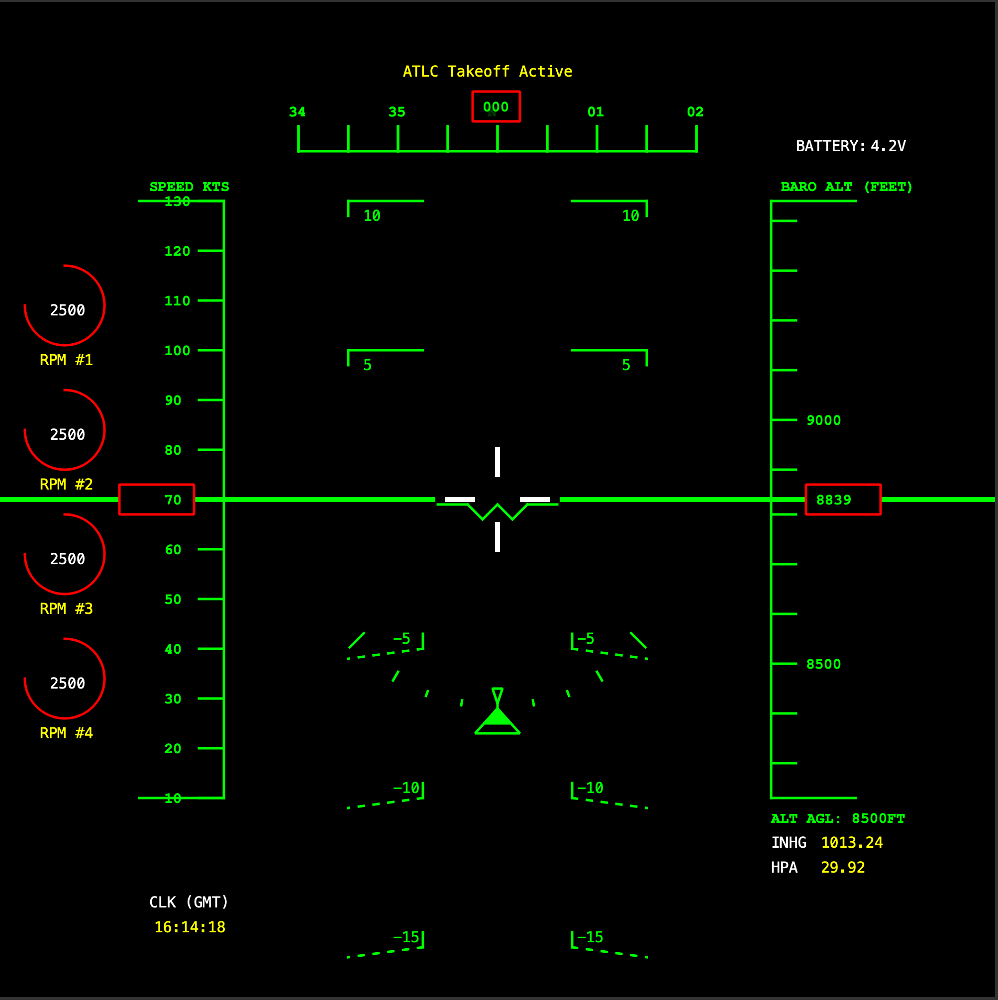
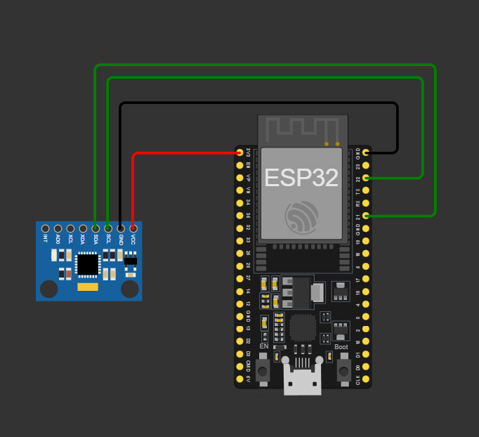

# Horus Project

<div align="center">


[](https://opensource.org/licenses/MIT)
[](https://isocpp.org/)
[](https://www.qt.io/)
[](https://www.espressif.com/)

**Open-Source Avionics Station for ISR UAVs**

*All-seeing, all-knowing flight visualization inspired by the Egyptian god of the sky*

A lightweight, customizable, and high-performance Primary Flight Display (PFD) built with C++ and Qt for Intelligence, Surveillance, and Reconnaissance (ISR) unmanned aerial vehicles. Features direct ESP32 + MPU6050 integration for real-time attitude sensing.

[Features](#features) • [Hardware Setup](#hardware-setup) • [Installation](#installation) • [Usage](#usage) • [Contributing](#contributing) • [License](#license)

</div>

---
## Latest Build Preview


## 🦅 Overview

**Horus Project** is a modern, aviation-grade Primary Flight Display designed for UAV ground control stations. Built from the ground up with performance and customization in mind, it provides real-time visualization of critical flight parameters including attitude, altitude, airspeed, and heading.

### Why Horus?

Named after the ancient Egyptian god of the sky, kingship, and protection - often depicted with the head of a falcon. Horus represents:

- 👁️ **All-Seeing Vision** - The Eye of Horus symbolizes perfect vision and protection
- ✈️ **Sky Dominion** - God of the sky and celestial navigation
- 🎯 **Precision & Protection** - Guardian deity who never misses
- 🦅 **Falcon's Perspective** - Sharp-eyed bird's view from above
- 📜 **Ancient Wisdom** - Time-tested reliability and trust

**Horus Project** delivers:

- ✈️ **Aviation-Grade Visualization** - Professional artificial horizon, pitch ladder, and roll indicator
- ⚡ **High Performance** - 60+ FPS rendering with optimized C++ and Qt
- 🎨 **Customizable** - Custom fonts, colors, and layout configurations
- 🔌 **ESP32 + MPU6050 Ready** - Direct serial integration with complementary filter attitude data
- 🖥️ **Cross-Platform** - Runs on Windows, macOS, and Linux
- 📖 **Open Source** - MIT licensed, community-driven development

---

## ✨ Features

### Core Instruments

- **Artificial Horizon**
  - Smooth pitch and roll visualization from real MPU6050 IMU data
  - 6x zoom for precise attitude monitoring (-15° to +15° visible range)
  - Dynamic horizon line with sky/ground differentiation

- **Pitch Ladder**
  - 5° increments with major marks every 10°
  - Positive angles (solid lines) and negative angles (dashed lines)
  - Precise angle labels in custom aviation fonts

- **Roll Indicator**
  - Visual roll scale with tick marks at ±10°, ±30°, ±60°
  - Dynamic roll pointer that tracks aircraft orientation
  - Reference marker for level flight

- **Altitude Tape**
  - Scrolling vertical tape with 100 ft increments
  - Major labels every 500 ft
  - Current altitude highlight box
  - AGL (Above Ground Level) display
  - Barometric Altitude based on QNH, ISA, OAT

- **QNH Display**
  - HPa
  - inHg

- **Speed Indicator**
  - Vertical speed tape
  - Airspeed readout
  - Ground speed display (soon)

- **Heading Indicator**
  - Heading Tape
  - NSWE Text Implemented

- **RPM Gauges**
  - Add multiple rpm readouts (maximum 4 recommended)
  - Animated progress tape (soon)

- **Battery Indicator**
  - Battery readout (Volts)
  - Battery percentage (soon)

### ESP32 Integration

- **Real-time IMU Data**
  - 50Hz update rate from MPU6050
  - Complementary filter (98% gyro, 2% accel) for stable attitude
  - Serial communication at 115200 baud
  - CSV format: `pitch,roll` for easy parsing

- **Hardware Specifications**
  - ESP32 microcontroller
  - MPU6050 6-axis IMU (accelerometer + gyroscope)
  - I2C communication (400kHz)
  - Automatic address detection (0x68 or 0x69)

### GPS & Navigation *(Planned)*

- **Real-time GPS Display**
  - Latitude/Longitude coordinates
  - GPS altitude (MSL)
  - Fix type indicator (No Fix, 2D, 3D, DGPS, RTK)
  - Satellite count with signal strength
  - HDOP/VDOP accuracy metrics
  - Ground speed from GPS

- **GPS Trail Visualization**
  - Flight path history (breadcrumb trail)
  - Configurable trail length
  - Color-coded by altitude/speed

- **Position Overlay**
  - Home point distance and bearing
  - Takeoff location marker
  - Current position in Lat/Lon/Alt format

### Camera Integration *(Planned)*

- **Live Video Feed**
  - Picture-in-Picture (PiP) camera overlay
  - Resizable/draggable video window
  - Full-screen camera view toggle (hotkey support)
  - Opacity control for overlay

- **Video Stream Support**
  - H.264/H.265 codec support
  - RTSP streaming protocol
  - UDP/RTP streams
  - USB camera support (V4L2 on Linux)
  - Custom pipeline configuration

- **Camera Information Display**
  - Gimbal pitch/roll/yaw angles
  - Zoom level indicator
  - Recording status (REC indicator)
  - Camera mode (Photo/Video)
  - Storage capacity remaining

### Display Features

- Real-time 50 Hz update rate (from ESP32)
- Anti-aliased rendering for smooth visuals
- Custom aviation fonts support (Nimbus Mono, etc.)
- Green-on-black color scheme (night vision compatible)
- Configurable zoom levels
- Adaptive UI that adjusts to roll and pitch
- Low-latency serial communication (<20ms)

---

## 🔧 Hardware Setup

### Required Components

- **ESP32 Development Board** (any variant with I2C support)
- **MPU6050 IMU Module** (GY-521 breakout board recommended)
- **USB Cable** (for ESP32 programming and serial communication)
- **Jumper Wires** (4 wires for I2C connection)

### Wiring Diagram

```
ESP32          MPU6050
-----          -------
3.3V    ---->  VCC
GND     ---->  GND
GPIO21  ---->  SDA
GPIO22  ---->  SCL
```



**Important Notes:**
- MPU6050 operates at 3.3V (ESP32 compatible)
- Do NOT connect to 5V
- Ensure good I2C connections (short wires preferred)
- AD0 pin on MPU6050 determines I2C address:
  - AD0 = GND → Address 0x68 (default)
  - AD0 = VCC → Address 0x69

### ESP32 Firmware

Upload the following code to your ESP32 using Arduino IDE:

```cpp
#include <Wire.h>

// MPU6050 I2C address
int MPU6050_ADDR = 0x68;

// MPU6050 Registers
const int PWR_MGMT_1 = 0x6B;
const int ACCEL_XOUT_H = 0x3B;

// Variables to store sensor data
int16_t accelX, accelY, accelZ;
int16_t gyroX, gyroY, gyroZ;
int16_t temperature;

// Complementary filter variables
float pitch = 0.0;
float roll = 0.0;
unsigned long lastTime = 0;

// I2C pins
#define SDA_PIN 21
#define SCL_PIN 22

void setup() {
  Serial.begin(115200);  // Match your Qt app's baud rate
  
  // Initialize I2C
  Wire.begin(SDA_PIN, SCL_PIN);
  Wire.setClock(400000);
  delay(1000);
  
  // Scan for I2C devices
  if (!findMPU6050()) {
    Serial.println("ERROR: MPU6050 not found!");
    while (1) delay(1000);
  }
  
  // Wake up MPU6050
  Wire.beginTransmission(MPU6050_ADDR);
  Wire.write(PWR_MGMT_1);
  Wire.write(0);
  Wire.endTransmission(true);
  delay(100);
  
  // Configure accelerometer (±2g)
  Wire.beginTransmission(MPU6050_ADDR);
  Wire.write(0x1C);
  Wire.write(0x00);
  Wire.endTransmission(true);
  
  // Configure gyroscope (±250°/s)
  Wire.beginTransmission(MPU6050_ADDR);
  Wire.write(0x1B);
  Wire.write(0x00);
  Wire.endTransmission(true);
  
  lastTime = millis();
  
  // Calibration pause
  delay(1000);
}

void loop() {
  // Read sensor data
  readMPU6050();
  
  // Calculate time delta
  unsigned long currentTime = millis();
  float dt = (currentTime - lastTime) / 1000.0;
  lastTime = currentTime;
  
  // Convert to g and degrees per second
  float accelX_g = accelX / 16384.0;
  float accelY_g = accelY / 16384.0;
  float accelZ_g = accelZ / 16384.0;
  float gyroX_dps = gyroX / 131.0;
  float gyroY_dps = gyroY / 131.0;
  
  // Calculate angles from accelerometer
  float accelPitch = atan2(accelY_g, sqrt(accelX_g * accelX_g + accelZ_g * accelZ_g)) * 180.0 / PI;
  float accelRoll = atan2(-accelX_g, accelZ_g) * 180.0 / PI;
  
  // Complementary filter (98% gyro, 2% accel)
  pitch = 0.98 * (pitch + gyroX_dps * dt) + 0.02 * accelPitch;
  roll = 0.98 * (roll + gyroY_dps * dt) + 0.02 * accelRoll;
  
  Serial.print(pitch, 2);
  Serial.print(",");
  Serial.println(roll, 2);
  
  delay(20);  // 50Hz update rate
}

void readMPU6050() {
  Wire.beginTransmission(MPU6050_ADDR);
  Wire.write(ACCEL_XOUT_H);
  Wire.endTransmission(false);
  Wire.requestFrom(MPU6050_ADDR, 14, true);
  
  // Read accelerometer
  accelX = Wire.read() << 8 | Wire.read();
  accelY = Wire.read() << 8 | Wire.read();
  accelZ = Wire.read() << 8 | Wire.read();
  
  // Read temperature (skip)
  temperature = Wire.read() << 8 | Wire.read();
  
  // Read gyroscope
  gyroX = Wire.read() << 8 | Wire.read();
  gyroY = Wire.read() << 8 | Wire.read();
  gyroZ = Wire.read() << 8 | Wire.read();
}

bool findMPU6050() {
  Wire.beginTransmission(0x68);
  if (Wire.endTransmission() == 0) {
    MPU6050_ADDR = 0x68;
    return true;
  }
  Wire.beginTransmission(0x69);
  if (Wire.endTransmission() == 0) {
    MPU6050_ADDR = 0x69;
    return true;
  }
  return false;
}
```

**Firmware Features:**
- Automatic I2C address detection
- Complementary filter for stable attitude estimation
- 50Hz data output rate
- CSV format for easy parsing
- Error detection and reporting

---

## 🛠️ Installation

### Prerequisites

- **C++ Compiler** with C++17 support (GCC 7+, Clang 5+, MSVC 2017+)
- **Qt 6.x** (or Qt 5.12+)
- **CMake 3.16+**
- **ESP32** with MPU6050 (hardware setup complete)
- **Arduino IDE** (for ESP32 firmware upload)

### Platform-Specific Setup

#### macOS
```bash
# Install Qt via Homebrew
brew install qt

# Clone the repository
git clone https://github.com/joaoliveira6704/Horus-Project.git
cd horus-project

# Build with CMake
mkdir build && cd build
cmake -DCMAKE_PREFIX_PATH=/opt/homebrew/opt/qt ..
make
./Horus
```

#### Linux (Ubuntu/Debian)
```bash
# Install dependencies
sudo apt-get update
sudo apt-get install qt6-base-dev build-essential cmake

# Clone and build
git clone https://github.com/joaoliveira6704/Horus-Project.git
cd horus-project
mkdir build && cd build
cmake ..
make
./Horus
```

#### Windows
```bash
# Install Qt from https://www.qt.io/download-qt-installer

# Clone repository
git clone https://github.com/joaoliveira6704/Horus-Project.git
cd horus-project

# Build with CMake
mkdir build
cd build
cmake -DCMAKE_PREFIX_PATH="C:/Qt/6.x.x/msvc2019_64" ..
cmake --build .
```

### Building with Qt Creator (Recommended)

1. Open Qt Creator
2. File → Open File or Project → Select `CMakeLists.txt`
3. Configure with your Qt kit
4. Build → Build Project
5. Run → Run

---

## 🚀 Usage

### Connecting to ESP32

1. **Upload Firmware to ESP32**
  - Open Arduino IDE
  - Install ESP32 board support
  - Copy the firmware code above
  - Select your ESP32 board and port
  - Upload the sketch

2. **Find Serial Port**
  - **Linux**: Usually `/dev/ttyUSB0` or `/dev/ttyACM0`
  - **macOS**: Usually `/dev/cu.usbserial-*` or `/dev/cu.SLAB_USBtoUART`
  - **Windows**: Usually `COM3` or higher

3. **Configure Horus Application**

```cpp
// In main.cpp, set up serial connection
QSerialPort *serial = new QSerialPort();
serial->setPortName("/dev/ttyUSB0");  // Change to your port
serial->setBaudRate(115200);
serial->open(QIODevice::ReadOnly);

// Connect to data handler
connect(serial, &QSerialPort::readyRead, [=]() {
    QByteArray data = serial->readLine();
    QList<QByteArray> values = data.split(',');
    
    if (values.size() == 2) {
        float pitch = values[0].toFloat();
        float roll = values[1].toFloat();
        attitudeIndicator->setAttitude(pitch, roll, altitude, speed);
    }
});
```

4. **Run the Application**
```bash
./Horus
```

### Data Format

The ESP32 sends attitude data in CSV format:
```
pitch,roll
12.34,-5.67
13.21,-5.89
...
```

- **Pitch**: Nose up (+) / Nose down (-)
- **Roll**: Right wing down (+) / Left wing down (-)
- **Update Rate**: 50Hz (every 20ms)
- **Precision**: 2 decimal places

### Calibration

For best results:
1. Place the MPU6050 on a level surface
2. Power on and wait 1 second for calibration
3. The initial readings should be near zero
4. If drift occurs, adjust complementary filter ratio in firmware

### Testing Without Hardware

The application includes simulation mode for testing without ESP32:

```cpp
// The default build can run with simulated data
./Horus
```

---

## 📝 Configuration

### Custom Fonts

Add your aviation fonts:

1. Place `.ttf` files in `fonts/` directory
2. Add to `resources.qrc`:
```xml
<file>fonts/YourFont.ttf</file>
```
3. Load in `main.cpp`:
```cpp
int fontId = QFontDatabase::addApplicationFont(":/fonts/YourFont.ttf");
```

### Adjusting Zoom Level

In `attitudeindicator.h`:
```cpp
float zoom = 6.0f; // Change this value (higher = more zoomed in)
```

### Color Scheme

Modify colors in drawing functions:
```cpp
painter.setPen(QPen(Qt::green, 0.5)); // Change Qt::green to your color
```

### Serial Port Configuration

Change in `main.cpp`:
```cpp
serial->setPortName("/dev/ttyUSB0");  // Your serial port
serial->setBaudRate(115200);           // Match ESP32 baud rate
```

---

## 🏗️ Project Structure

```
horus-project/
├── main.cpp                 # Application entry point, serial handling
├── attitudeindicator.h      # Core PFD widget with all instruments
├── CMakeLists.txt          # CMake build configuration
├── resources.qrc           # Qt resources (fonts, icons)
├── fonts/                  # Custom aviation fonts
│   ├── armarurgt.ttf
│   └── NimbusMono.ttf
├── firmware/               # ESP32 firmware
│   └── mpu6050_imu.ino    # MPU6050 attitude sensing code
└── README.md              # This file
```

---

## 🤝 Contributing

We welcome contributions! Here's how you can help:

### Ways to Contribute

- 🐛 **Report bugs** - Open an issue with reproduction steps
- 💡 **Suggest features** - Share your ideas in Discussions
- 📝 **Improve documentation** - Fix typos, add examples
- 🔧 **Submit pull requests** - Add features or fix bugs
- 🔌 **Hardware integration** - Add support for other IMU sensors

### Development Setup

1. Fork the repository
2. Create a feature branch: `git checkout -b feature/amazing-feature`
3. Make your changes
4. Test thoroughly (with real hardware if possible)
5. Commit: `git commit -m 'Add amazing feature'`
6. Push: `git push origin feature/amazing-feature`
7. Open a Pull Request

### Code Style

- Follow C++17 standards
- Use Qt naming conventions (camelCase)
- Comment complex algorithms
- Keep functions focused and small
- Add const where appropriate

---

## 🗺️ Roadmap

### Version 1.0 (Current)
- ✅ Artificial horizon
- ✅ Pitch ladder
- ✅ Roll indicator
- ✅ Altitude tape
- ✅ Custom fonts support
- ✅ Airspeed tape
- ✅ Heading indicator
- ✅ Flight mode indicator
- ✅ ESP32 + MPU6050 integration

### Version 1.1 (In Progress)
- ⏳ Vertical speed indicator
- ⏳ GPS coordinate display (add GPS module to ESP32)
- ⏳ Battery voltage/percentage
- ⏳ Barometric altitude (BMP280/BME280 integration)

### Version 1.5 (Planned)
- 📋 Live camera feed integration
  - ESP32-CAM support
  - PiP (Picture-in-Picture) video overlay
  - RTSP streaming from ESP32
- 📋 GPS tracking and visualization
  - NEO-6M/7M GPS module integration
  - Real-time coordinates
  - GPS trail visualization
- 📋 Additional sensor support
  - Magnetometer (compass heading)
  - Barometer (altitude refinement)
  - Temperature/humidity

### Version 2.0 (Future)
- 📋 Interactive map overlay
- 📋 Waypoint navigation display
- 📋 Data logging and replay
- 📋 Multi-sensor fusion (Kalman filter)
- 📋 Wireless telemetry (ESP-NOW, WiFi)

---

## 📊 Performance

- **Frame Rate**: 60+ FPS on modern hardware
- **CPU Usage**: <5% on Intel Core i5
- **Memory**: ~50 MB RAM
- **Serial Latency**: <20ms
- **IMU Update Rate**: 50Hz from ESP32
- **Resolution**: Scalable from 800x600 to 4K

---

## 🐛 Known Issues

- Horizon line clipping with altitude tape needs refinement during high roll angles
- Font loading may fail silently on some systems (falls back to system fonts)
- High zoom levels (>8.0) may show rendering artifacts
- MPU6050 may exhibit drift over long periods (complementary filter limitation)
- Serial port auto-detection not yet implemented (manual configuration required)

See [Issues](https://github.com/joaoliveira6704/Horus-Project/issues) for full list.

---

## 🔧 Troubleshooting

### ESP32 Connection Issues

**Problem**: "MPU6050 not found!" error
- Check I2C wiring (SDA/SCL connections)
- Verify MPU6050 power (3.3V, not 5V)
- Try the other I2C address (0x69 instead of 0x68)
- Test with I2C scanner sketch

**Problem**: No data in Qt application
- Verify correct serial port in code
- Check baud rate matches (115200)
- Test with serial monitor first
- Ensure ESP32 is powered and running

**Problem**: Erratic attitude readings
- Recalibrate on level surface
- Check for magnetic interference
- Adjust complementary filter ratio
- Consider adding sensor fusion (Kalman filter)

### Qt Application Issues

**Problem**: Serial port permission denied (Linux)
```bash
sudo usermod -a -G dialout $USER
# Then log out and back in
```

**Problem**: Cannot find serial port
- Check `ls /dev/tty*` (Linux/Mac)
- Check Device Manager (Windows)
- Verify USB cable supports data (not charge-only)

---

## 📚 Documentation

- [ESP32 Setup Guide](docs/ESP32_SETUP.md)
- [MPU6050 Calibration](docs/MPU6050_CALIBRATION.md)
- [Serial Protocol](docs/SERIAL_PROTOCOL.md)
- [Adding Sensors](docs/SENSOR_EXPANSION.md) *(Coming Soon)*

---

## 🙏 Acknowledgments

- **Qt Framework** - Cross-platform UI framework
- **ESP32 Community** - Arduino core and libraries
- **Invensense** - MPU6050 IMU sensor
- **ArduPilot Community** - Inspiration and protocols
- **Open-source contributors** - Thank you! ❤️

---

## 📄 License

This project is licensed under the **MIT License** - see the [LICENSE](LICENSE) file for details.

```
MIT License

Copyright (c) 2025 Horus Project Contributors

Permission is hereby granted, free of charge, to any person obtaining a copy
of this software and associated documentation files (the "Software"), to deal
in the Software without restriction, including without limitation the rights
to use, copy, modify, merge, publish, distribute, sublicense, and/or sell
copies of the Software, and to permit persons to whom the Software is
furnished to do so, subject to the following conditions:

The above copyright notice and this permission notice shall be included in all
copies or substantial portions of the Software.

THE SOFTWARE IS PROVIDED "AS IS", WITHOUT WARRANTY OF ANY KIND, EXPRESS OR
IMPLIED, INCLUDING BUT NOT LIMITED TO THE WARRANTIES OF MERCHANTABILITY,
FITNESS FOR A PARTICULAR PURPOSE AND NONINFRINGEMENT. IN NO EVENT SHALL THE
AUTHORS OR COPYRIGHT HOLDERS BE LIABLE FOR ANY CLAIM, DAMAGES OR OTHER
LIABILITY, WHETHER IN AN ACTION OF CONTRACT, TORT OR OTHERWISE, ARISING FROM,
OUT OF OR IN CONNECTION WITH THE SOFTWARE OR THE USE OR OTHER DEALINGS IN THE
SOFTWARE.
```

---

## 📬 Contact

- **Project**: [Horus Project](https://github.com/joaoliveira6704/Horus-Project)
- **Issues**: [GitHub Issues](https://github.com/joaoliveira6704/Horus-Project/issues)
- **Discussions**: [GitHub Discussions](https://github.com/joaoliveira6704/Horus-Project/discussions)

---

<div align="center">

**Made with ☕ and ✈️ by the UAV community**

**Powered by ESP32 + MPU6050**

⭐ Star this repo if you find it useful!

</div>